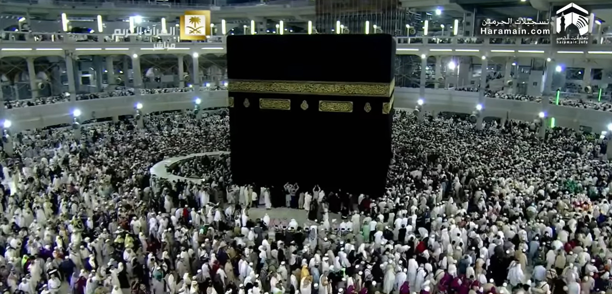
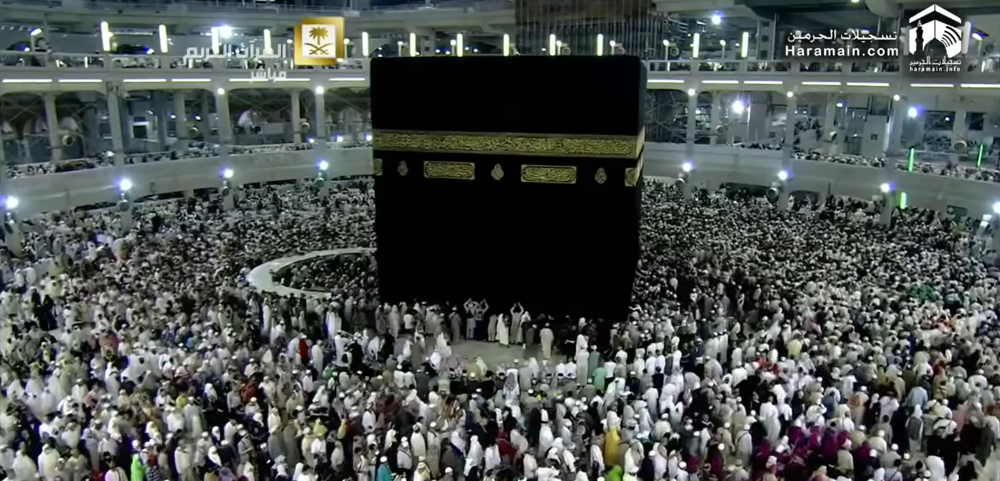
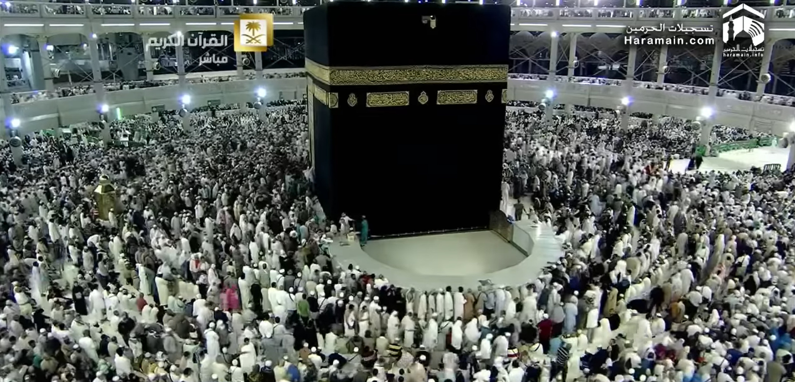
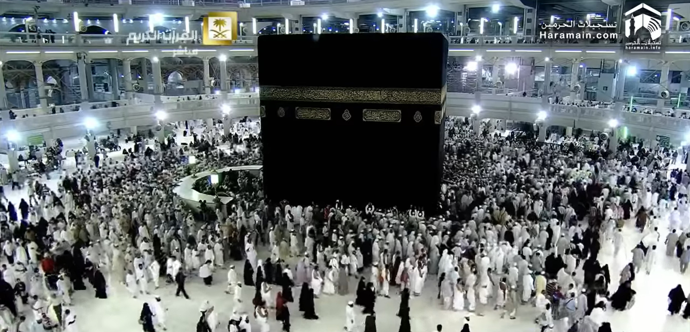

# Video Analytics using Deep Learning for Massive Crowd Instant Segments and Detections
# Overview
**Crowd Pose Detection**, a deep learning-based method for the detection of human poses in huge, dense crowds like the Hajj pilgrimage. Traditional pose estimation fails in extreme crowd conditions. This project aims to develop a deep learning-based method to massive crowd segmentation and detection in video analytics and bridge that gap with a specially trained, COCO-formatted dataset and customized Mask R-CNN architecture. With the use of deep neural networks and advanced computer vision algorithms, the system is capable of processing crowd scenes in real-time and providing real-time segmentations and detections.
# Key Features
**Crowd Segmentation and Detection:** Detect and segment crowds in video frames using state-of-the-art deep learning techniques, providing accurate individual pose detection even in extreme conditions.

**Real-time Analysis:** The system is built to process enormous video feeds in real time, facilitating immediate crowd analysis, which is critical for safety monitoring and event management.

**Deep Learning:** Utilizes **Mask R-CNN** for precise segmentation and detection, enabling pixel-level accuracy in crowded environments.

**Crowd Safety Enhancements:** Use of pose detection and crowd segmentation to assess safety risks and prevent overcrowding during high-density events.

**Scalability:** The system is scalable, designed to work across different environments, from small gatherings to massive events, and can handle multiple video inputs simultaneously.

# Technologies Used
**Deep Learning Models:** Convolutional Neural Networks (CNNs), **Mask R-CNN**, and other advanced models for accurate object detection and segmentation.

**Python:** The project is developed using Python 3.7, leveraging its rich ecosystem of machine learning libraries.

**CVAT:** CVAT (Computer Vision Annotation Tool) is used for annotating video frames to create the dataset for model training.

## Installation

To run this project, make sure to have **Python 3.7 installed**, along with the necessary libraries. Here are the steps to set up the environment:

### 1. Clone the repository
```bash
#Grab the repo
git clone https://github.com/HHassanHub/crowd-pose-detection.git

#Enter the project directory
cd crowd-pose-detection
```

### 2. Setup Instructions

1. Install all dependencies from `requirements.txt`. **Python 3.7** and **TensorFlow 2.0.0** are recommended for compatibility with the Mask R-CNN architecture.

```bash
pip install -r requirements.txt
```
### 3. Install Dependencies
Create a virtual environment and install dependencies using pip:

```bash
python3 -m venv env
source env/bin/activate  # On Windows use: `env\Scripts\activate`
pip install -r requirements.txt
```
## Dataset
For this project, a total of **1596 images** were extracted from a video. From These, **15 images** has been annotated and these will be used for the crowd segmentation and detection tasks.


## Annotation
Use [CVAT](https://github.com/openvinotoolkit/cvat) to annotate your training dataset. Read the CVAT documentation to see how to configure and annotate your video frames. To annotate your training dataset with CVAT, and the images to train deep learning models.

## Running the Project
When the dataset is ready, run the following command to start the video analytics pipeline:
```bash
python main.py
```
This will initiate the process of analyzing the crowd footage and providing instant pose detection and segmentation.

## Training Results
### Original Input Frames

These are a few sample frames extracted from the Hajj video used for training:

<p float="middle">
  
  
  
  
</p>

---

## Training Output

These are a few sample results after training the model on the Hajj video frames:

<p float="middle">

<br>

<br>

<br>

</p>

---

## Test Results
coming soon

## Future Enhancements
**Real-Time Inference Demo:** We plan to add a real-time inference demo that will process live video streams for on-the-fly crowd pose detection and analysis.

**Integration with IoT Devices:** The system could be integrated with IoT-based solutions for real-time crowd management, using pose detection data to control crowd flow and provide alerts.

**Model Accuracy Improvement:** Future work will focus on improving model performance for handling occlusions, varying lighting conditions, and other challenges posed by highly dynamic environments.

**Benchmarking and Paper Publication:** The project will also involve benchmarking the model’s performance and publishing findings in a research paper.
